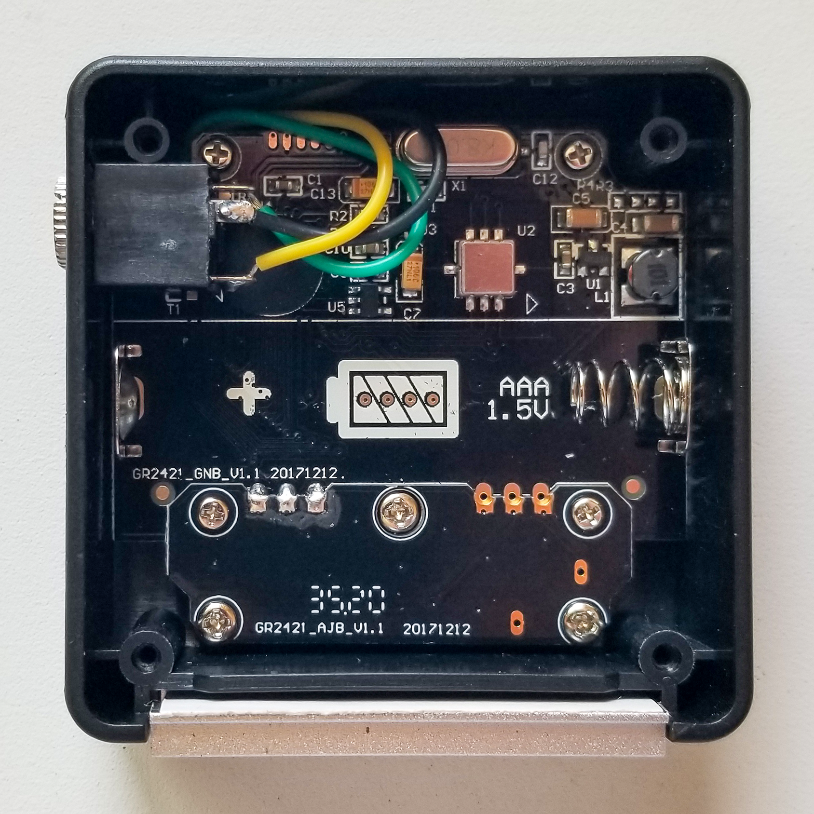

# How to Hack the 
# GemRed Mini Angle Gauge
## (And Interface it to an Arduino proMicro)

The GemRed angle gauge this library was designed for is the 82421 Mini Angle Gauge. I got mine 
from [Amazon](https://amazon.com/dp/B078JNS7V6). I'm sure they (or their clones) are available 
from the other usual sources and, from the looks of the PCB, I would really surprised if other 
GemRed angle gauges were much different. Here's what the one I have looks like:

To hack it, begin by removing the battery. Then take the back cover off by unscrewing the #0 JIS 
cross-head screws in the four corners. (Two are under stackers which you'll need to remove first.) 
Next remove the PCB by unscrewing the seven (!) screws attaching it to the front part of the case. 
There are two kinds of screw here: four JIS #0 cross-head (which are different from the ones 
securing the back cover) in the PCB corners and three JIS #1 cross-head for the daughter board 
holding the switches.

Remove the PCB, leaving the LCD display in the case &ndash; it's not attached but may stick to the 
PBC and then fall off, so be careful. Turn it over and solder the hack's wires to the pads of 
what's labeled "J3" and to the "+" contact of the battery holder like this:

Here the black wire is GND; the green wire is +1.5V; the yellow wire is TX.

Figure out how you'll get the wires to the outside world and then reassemble the GemRed. I chose 
to modify the case to let me install a 3.5mm Stereo Jack to lead the wires out. The result, after 
reinstalling the PCB and adding the jack looks like this: 

Using a jack like this for the hack means you can still use the device as intended. With nothing 
plugged into the jack, pop in a battery and you're good to go.

 I used this super simple circuit to interface the GemRed device to a 5V Arduino proMicro:

The 2N3904 acts as a crude linear voltage regulator to serve as a battery eliminator. Internally 
the GemRed device runs at 3.3V, so it has a built-in boost converter to raise the voltage 
normally provided by a AAA cell to what it wants. That means it isn't fussy about the exact input 
voltage. When it's running it draws about 16mA. That's below the 20mA recommended current for a GPIO 
pin on a proMicro, and well below the maximum 40mA.