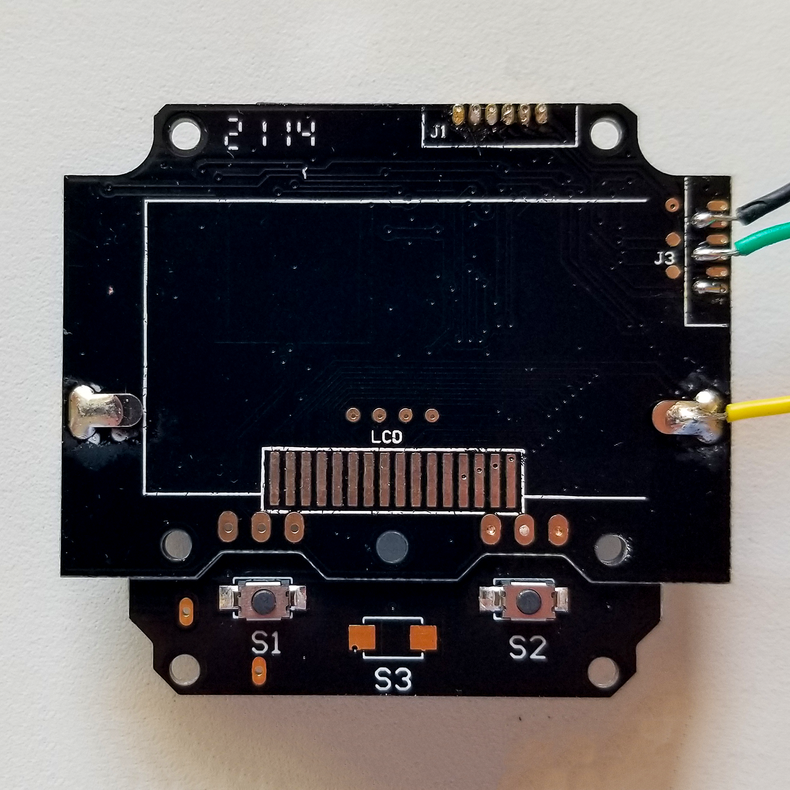
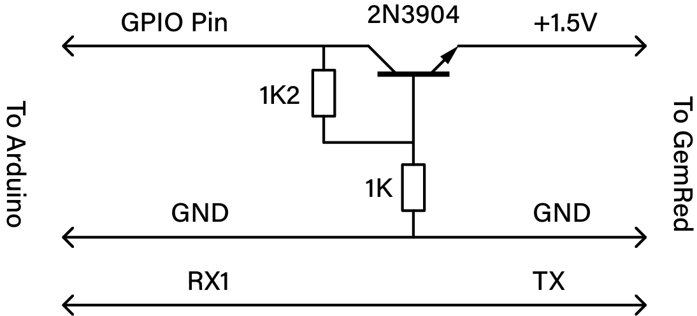

# How to Hack the 
# GemRed Mini Angle Gauge
## And Interface it to
## An Arduino proMicro

The GemRed angle gauge this library was designed for is the 82421 Mini Angle Gauge. I got mine 
from [Amazon](https://amazon.com/dp/B078JNS7V6), but I'm sure they (or their clones) are available 
from the other usual sources. Here's what it looks like:

To hack it, remove the battery. Then take the back cover off by unscrewing the #0 JIS cross-head 
screws in the four corners. (Two are under stackers which you'll need to remove first.) Then 
remove the PCB by unscrewing the seven (!) screws attaching it to the front part of the case. They 
used two kinds of screw here: four JIS #0 cross-head (which are different from the ones securing the 
back cover) in the PCB corners and three JIS #1 cross-head for the daughter board holding switches.

Remove the PCB leaving the LCD display in the case &ndash; it's not attached but may stick 
temporarily and then fall off, so be careful. Turn it over and solder the hack's wires to the pads 
like this:

The black wire is GND; the green wire is +1.5V; the yellow wire is TX.

Figure out how you'll get the wires to the outside world and then reassemble the GemRed. I chose 
to modify the case to let me install a 3.5mm Stereo Jack to lead the wires out. The result, after 
reinstalling the PCB and adding the jack looks like this: 

Using a jack like this for the hack means you can still use the device as intended. Just unplug it, 
pop in a battery and you're good to go.

 I used this super simple circuit to interface the GemRed device to a 5V Arduino proMicro:

The 2N3904 acts as a crude linear voltage regulator to provide around 1.5V to the device. Internally 
the GemRed device runs at 3.3V. It has a boost power supply to raise the voltage normally provided 
by a AAA cell to what it wants. That means it isn't fussy about the exact input voltage. When it's 
running it draws about 16mA. That's below the 20mA recommended current for a GPIO pin on a 
proMicro, and well below the maximum 40mA.